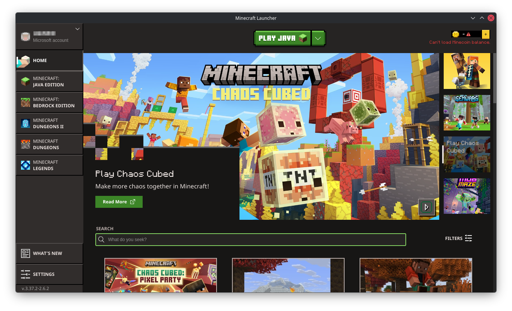
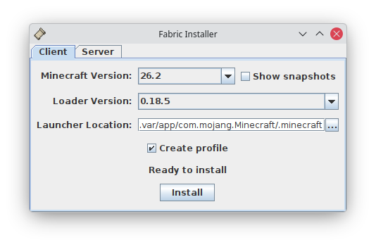

# Minecraft (Flatpak)

Welcome to the unofficial [Flathub distribution of Minecraft](https://flathub.org/apps/details/com.mojang.Minecraft). To get started, as customary for the installation of any Flathub app, make sure to follow the [setup guide](https://flatpak.org/setup/) before installing the Minecraft Flatpak.

## Usage Notes

For non-vanilla Minecraft players, please read these important usage notes.

#### Resource Packs, Modifications, etc.

If you want to use various resource packs or modifications (mods), you can transfer the resources to `~/.var/app/com.mojang.Minecraft/.minecraft`. There, the resource pack can be extracted as a folder to the `resourcepacks` folder, and mods (typically ending with "`.jar`") can be put in the `mods` folder.

#### Fabric Mod Loader

A common way to use Minecraft mods is by using the Fabric Mod Loader. It will act as an entire Minecraft profile that you will launch. Each Fabric instance is versioned similarly to regular Minecraft instances (e.g. one instance for Fabric 0.19.3, another instance for Fabric 0.18.5). Note that each Fabric version corresponds to a regular Minecraft instance of a chosen version, but modded to add extra functionality and content that official Minecraft does not provide.

To install, download the Fabric universal installer from their [official website](https://fabricmc.net/use/installer/). This will be a `.jar` file. Once you downloaded the `.jar` file, open it from your File Manager or using a terminal by executing `java -jar /path/to/your/download/location/fabric-installer-*.jar` (you need to have Java Runtime Environment installed on your system). This will launch the forge installation window. There, navigate to `~/.var/app/com.mojang.Minecraft/.minecraft`, check "Create profile", and click "OK" (screenshot shown below).

Now, when you restart the Minecraft launcher, you will see a new Minecraft listed clearly with "fabric-loader" and the version number you installed. Happy modding!

#### Forge

Another way to use Minecraft modifications ("mods") is through Minecraft Forge. Essentially, Forge will act as an entire Minecraft instance that you will launch. Each Minecraft Forge instance is versioned similarly to regular Minecraft instances (e.g. one instance for Forge 1.7.10, another instance for Forge 1.15.2). Note that each Forge version corresponds to a regular Minecraft instance of that version, but modded to add extra functionality and content that official Minecraft does not provide.

> **Why using Forge?** Despite there being NeoForge, you might have modpacks that you would like to play (such as RLCraft) that requires the Forge mod loader. Another reason is that OptiFine can only be used as either the only standalone mod, or via Forge, and you might need it for shaders or rendering optimization gains.

To install, download a version of Minecraft Forge from their [official website](https://files.minecraftforge.net/net/minecraftforge/forge/). This will be a `.jar` file. Once you downloaded the `.jar` file, open it from your File Manager or using a terminal by executing `java -jar /path/to/your/download/location/forge*.jar` (you need to have Java Runtime Environment installed on your system). This will launch the forge installation window. There, navigate to `~/.var/app/com.mojang.Minecraft/.minecraft` and click "OK" (screenshot shown below).

Now, when you restart the Minecraft launcher, you will see a new Minecraft listed clearly with "Forge" and the version number you installed. Happy modding!

